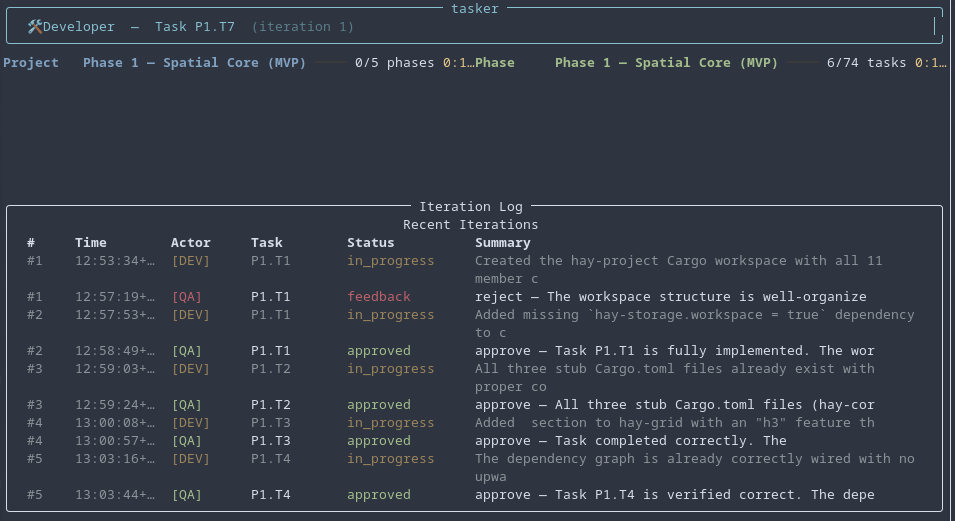

# tasker

Goose-based task orchestration CLI with a QA/Dev feedback loop, interactive issue resolution, graceful error recovery, and optional version control integration (Jujutsu or Git).

`tasker` reads a markdown task list, assigns each task to a **Developer** goose agent, then sends the result to a **QA Reviewer** goose agent. If QA rejects the work, feedback is routed back to the developer in a loop until the task is approved — then the next task begins. When agents encounter blockers or return malformed output, `tasker` escalates gracefully through multiple recovery strategies, including an interactive chat mode where the user can resolve ambiguities directly.

## Screenshot



## How it works

```
┌─────────┐      task P1.T1       ┌──────────┐
│         │ ──────────────────►    │          │
│   QA    │                        │  Dev     │
│ Reviewer│  ◄──────────────────   │ Agent    │
│         │   implementation      │          │
└─────────┘                        └──────────┘
     │         ▲                        │
     │         │                        │
     │ approve │ blocked                │ status=blocked
     │ → done  │ → triage               │ → QA triage
     │ reject  │                        │
     │ → feedback                        │ done → QA review
     ▼         │                        ▼
  next task    │                   re-implement
               │
          needs_user_input
               │
               ▼
        ┌──────────────┐
        │  💬 Chat     │ ← user types answers
        │  with User   │   QA processes responses
        └──────────────┘
               │
          resolved → dev retries
          /skip → mark done, next task
```

### Normal flow

1. **Parser** reads the markdown file and extracts phases/tasks.
2. **Orchestrator** picks the first incomplete task and sends it to the Developer.
3. **Developer** (goose agent) implements the task, returns a JSON status report.
4. **QA Reviewer** (goose agent) inspects the code and returns approve/reject.
5. If rejected, feedback loops back to the Developer. If approved, the task is marked `[x]` in the markdown and the next task starts.

### Error handling flows

#### Dev blocked → QA triage

When the Developer returns `"status": "blocked"` (unclear requirements, missing specs, unknown dependencies):

1. The blocker description and the developer's suggestion are sent to QA.
2. QA checks the project's specification files to see if the answer exists.
3. If QA can resolve it from docs → returns `"reject"` with guidance, dev retries.
4. If QA can't resolve it → returns `"needs_user_input"` with a specific question → triggers **interactive chat**.

#### Interactive chat mode

When QA returns `"decision": "needs_user_input"`, the pipeline pauses and enters chat mode:

1. The Live UI is paused (so `input()` works).
2. QA's question is displayed to the user.
3. The user types a response → sent to the QA agent for processing.
4. QA can: ask follow-up questions (`needs_user_input`), give dev guidance (`reject`), or accept (`approve`).
5. The loop continues until QA approves or the user types `/done` (resolved) or `/skip` (move on).
6. After chat resolves, the pipeline resumes with the dev retrying (or task marked done).

#### Graceful degradation (malformed goose output)

When the Developer agent returns output that can't be parsed (no valid JSON with `status` key), the orchestrator escalates through recovery stages:

| Stage | Attempts | Instruction to dev |
|-------|----------|--------------------|
| NORMAL | 1 | Standard task prompt |
| CONTINUE | 3 | "Continue from where you left off and respond with JSON" |
| SUBTASK | 3 | "Break into subtasks, implement one, respond with JSON" |
| SUMMARIZE | 3 | "Stop implementing, summarize progress, respond with JSON `blocked`" |

If all stages are exhausted, a synthetic `blocked` response is generated and sent to QA for triage (which may trigger interactive chat).

## How it talks to goose

`tasker` invokes `goose run` as a subprocess for each agent turn. Key CLI details:

- **`--name <session>`** — names the goose session. Reusing the same name across invocations gives agents persistent context (goose auto-resumes).
- **`--recipe <path>`** — loads a YAML recipe that defines the agent's system prompt, extensions, and parameterized prompt template. Mutually exclusive with `--text`.
- **`--params KEY=VALUE`** — passes task data into recipe template variables (`{{ key }}`). Newlines and special characters are escaped automatically.
- **`--output-format json`** — goose returns a JSON envelope `{"messages": [...]}`. `tasker` extracts the last assistant message text and parses the structured JSON response from it.
- **`--max-turns N`** — limits how many tool calls the agent can make per invocation.
- **`--with-builtin developer`** — ensures the developer extension (file ops, shell) is available.

> ⚠️ `--session-id` requires `--resume` and is not used here. `--name` provides session persistence without that constraint.

## Installation

```bash
cd tools/tasker
uv sync
```

## Usage

```bash
cd tools/tasker

# Full run — all tasks
uv run tasker --dev recipes/recipe-dev.yaml \
              --qa recipes/recipe-qa.yaml \
              specs/arch/99-todo.md

# Start from a specific phase (1-based), earlier phases marked done
uv run tasker --dev recipes/recipe-dev.yaml \
              --qa recipes/recipe-qa.yaml \
              specs/arch/99-todo.md \
              --start-phase 3

# Custom model/provider
uv run tasker --dev recipes/recipe-dev.yaml \
              --qa recipes/recipe-qa.yaml \
              specs/arch/99-todo.md \
              --model claude-sonnet-4-20250514 \
              --provider anthropic

# Custom iteration log location
uv run tasker --dev recipes/recipe-dev.yaml \
              --qa recipes/recipe-qa.yaml \
              specs/arch/99-todo.md \
              --log output/iterations.jsonl

# With Jujutsu (jj) integration — each task gets its own commit
uv run tasker --dev recipes/recipe-dev.yaml \
              --qa recipes/recipe-qa.yaml \
              specs/arch/99-todo.md \
              --vcs jj

# With Git integration — each task gets a squash-merged commit on a feature branch
uv run tasker --dev recipes/recipe-dev.yaml \
              --qa recipes/recipe-qa.yaml \
              specs/arch/99-todo.md \
              --vcs git

# Rotate sessions per phase (## heading) instead of default sub-phase
uv run tasker --dev recipes/recipe-dev.yaml \
              --qa recipes/recipe-qa.yaml \
              specs/arch/99-todo.md \
              --session-scope phase

# Rotate sessions per task (fresh context every task)
uv run tasker --dev recipes/recipe-dev.yaml \
              --qa recipes/recipe-qa.yaml \
              specs/arch/99-todo.md \
              --session-scope task

# Force a new session on the next task (one-shot)
uv run tasker --dev recipes/recipe-dev.yaml \
              --qa recipes/recipe-qa.yaml \
              specs/arch/99-todo.md \
              --new-session
```

## CLI Options

| Option | Default | Description |
|--------|---------|-------------|
| `--dev` | *(required)* | Path to the developer goose recipe (YAML) |
| `--qa` | *(required)* | Path to the QA goose recipe (YAML) |
| `task_file` | *(required)* | Path to the markdown task list |
| `--log` | `<task_file>.iterations.jsonl` | JSONL iteration log path |
| `--max-iterations` | `10` | Max QA↔Dev rounds per task before skipping |
| `--max-turns` | `80` | Max goose agent turns per invocation |
| `--timeout` | `600` | Timeout (seconds) per goose run. Process is killed and relaunched with context on timeout. |
| `--model` | *(goose default)* | Override goose model |
| `--provider` | *(goose default)* | Override goose provider |
| `--start-phase` | *(none)* | Start from phase N (1-based) |
| `--vcs` | `none` | VCS integration: `jj` (Jujutsu), `git` (feature branch + squash merge), or `none` (disabled) |
| `--session-scope` | `subphase` | When to rotate goose sessions: `phase` (per `##`), `subphase` (per `###`), or `task` (per `- [ ]`) |
| `--new-session` | *(off)* | Force a new goose session on the next task (one-shot) |
| `--monitor-log` | `tasker.log` | Structured monitor log path (set to empty or use `--no-monitor-log` to disable) |
| `--no-monitor-log` | *(off)* | Disable the monitor log file (console/stderr logging still active) |
| `--log-level` | `WARNING` | Minimum level for console (stderr) output: `debug`, `info`, `warning`, `error`, `critical` |
| `--file-log-level` | `DEBUG` | Minimum level for the monitor log file: `debug`, `info`, `warning`, `error`, `critical` |

## Version control integration

`tasker` supports optional VCS integration via the `--vcs` flag. When enabled, each approved task produces one clean commit, and the diff is injected into the QA prompt as `project_context` so QA sees exactly what changed.

Two backends are available:

| Backend | Flag | How it works |
|---------|------|-------------|
| **Jujutsu** | `--vcs jj` | Each task gets an isolated `jj new` change, committed on approval. Linear history, one commit per task. |
| **Git** | `--vcs git` | Each task gets a feature branch. On approval, the branch is squash-merged onto the base branch as a single commit. |
| None | `--vcs none` (default) | No version control — tasks are marked `[x]` in the markdown file only. |

### Jujutsu (jj) backend

When `--vcs jj` is enabled, the project directory must already be a jj repository (initialized with `jj git init`).

```
base ──► jj new "P1.T1: <task>" ──► dev implements ──► QA reviews diff ──► jj commit ──► next task
```

1. **Task begin**: `jj new <parent_change> -m "P1.T1: <task text>"` creates an isolated working-copy change.
2. **Developer** implements the task (no version control commands needed — jj tracks everything automatically).
3. **QA review**: `jj diff --from <base_change>` is computed and injected into the QA prompt as `project_context`.
4. **Task approved**: The orchestrator marks the task `[x]` in the markdown file, then `jj commit` finalizes the change into a single clean commit.
5. **Task rejected**: The working-copy change is reused — the developer's next iteration builds on the same change. On approval, only the final state is committed.
6. **Next task**: `jj new <committed_change>` chains from the previous task's commit.

**Requirements**: `jj` on `PATH`, a jj repository, at least one base commit.

### Git backend

When `--vcs git` is enabled, the working directory must be a clean git repository on a branch.

```
base ──► git checkout -b task/P1.T1 ──► dev implements ──► QA reviews diff ──► squash merge ──► next task
```

1. **Task begin**: `git checkout -b task/<label>` creates a feature branch from the current HEAD.
2. **Developer** implements the task (commits freely on the feature branch).
3. **QA review**: `git diff <base_commit>..<feature_branch>` is computed and injected into the QA prompt as `project_context`.
4. **Task approved**: The orchestrator marks the task `[x]` in the markdown, then the feature branch is squash-merged onto the base branch as a single commit (`git merge --squash` + `git commit`). The feature branch is deleted.
5. **Task rejected**: The feature branch is reused — the developer's next iteration builds on the same branch. On approval, only the final state is squash-merged.
6. **Next task**: A new feature branch is created from the updated base branch HEAD.

**Requirements**: `git` on `PATH`, a git repository on a branch (not detached HEAD), clean working tree at startup.

> **Important**: All VCS commands use flags to avoid opening `$EDITOR`. No manual intervention is ever required.

## Task file format

Markdown files with `## Phase N` headings and `- [ ]` / `- [x]` checkboxes. Optional `###` sub-phase headings group tasks for session scope control:

```markdown
## Phase 1 — MVP

### P1-1 Setup
- [ ] Create project workspace with Cargo.toml
- [ ] Implement core geometry types

### P1-2 Features
- [ ] Add R-Tree spatial index
- [ ] Implement Hilbert curve sorting

## Phase 2 — Advanced

- [x] Set up CI pipeline
- [ ] Add logging support
```

The `###` headings are recognized by the parser and used by `--session-scope subphase` to rotate goose sessions at sub-phase boundaries. Files without `###` headings work unchanged.

## Environment variables

`tasker` sets these for every goose invocation:

```bash
GOOSE_CONTEXT_STRATEGY=summarize
GOOSE_AUTO_COMPACT_THRESHOLD=0.35
```

## Session persistence

Each run generates unique session names for QA and Developer:

```
Developer session: dev_20260413_111500_a1b2c3
QA session:       qa_20260413_111500_d4e5f6
```

These are reused across all tasks within a run via `goose run --name`, giving the agents persistent context. The Developer agent accumulates knowledge across tasks; the QA agent builds a review history.

Sessions can be inspected with `goose session list`.

### Session scope (`--session-scope`)

By default, goose sessions accumulate context across all tasks in a run. For large task files (20+ tasks), this can cause the context window to fill up, leading to truncated responses. The `--session-scope` option controls when new sessions are created:

| Scope | Flag | Boundary | When sessions rotate |
|-------|------|----------|---------------------|
| `phase` | `--session-scope phase` | `##` heading | Once per phase — most context, risk of overflow |
| `subphase` (default) | `--session-scope subphase` | `###` heading | Once per sub-phase — good balance |
| `task` | `--session-scope task` | `- [ ]` item | Every task — no overflow, no cross-task context |

Example with sub-phase scope:

```
Developer session: dev_20260413_111500_a1b2c3   ← P1-1 tasks
QA session:       qa_20260413_111500_d4e5f6

[P1.T4] Session scope changed: P1::P1-1 Database → P1::P1-2 API — rotating sessions
Developer session: dev_20260413_120300_g7h8i9   ← P1-2 tasks (fresh context)
QA session:       qa_20260413_120300_j9k0l1
```

### Manual session reset (`--new-session`)

If the agent starts getting slow or confused mid-subphase, use `--new-session` to force a fresh session on the very next task:

```bash
uv run tasker --dev recipes/recipe-dev.yaml \
              --qa recipes/recipe-qa.yaml \
              specs/arch/99-todo.md \
              --new-session
```

This is a one-shot flag — it fires once and then the normal scope-based rotation takes over.

## Structured monitoring

`tasker` uses [structlog](https://www.structlog.org/) for structured, key-value logging of all orchestration events. Logs are written to **two independent destinations**:

| Destination | Default level | Purpose |
|---|---|---|
| **Monitor log file** (`--monitor-log`) | `DEBUG` | Captures everything — orchestration decisions, session rotations, recovery escalations, subprocess launches, VCS ops, parser events, UI lifecycle. |
| **Console (stderr)** | `WARNING` | Shows warnings and errors in the terminal. Deliberately writes to **stderr** (not stdout) so it never interferes with Rich's Live UI, which renders on stdout. |

> **Why stderr?** Rich's `Live` display takes over stdout for the progress table and status bars. All structured log output goes to stderr so the two never mix — you can pipe stdout without capturing logs, and logs never corrupt the UI.

### Log files

- **`tasker.log`** (monitor log) — human-readable, key-value format. One entry per line with timestamp, level, event name, and context fields.
- **`<task_file>.iterations.jsonl`** (iteration log) — machine-parseable JSON records of QA↔Dev exchanges only. Controlled separately via `--log`.

The monitor log uses a `RotatingFileHandler` (10 MB max, 3 backups) so it won't grow unbounded on long runs.

### Controlling log levels

Console and file levels are independent. Examples:

```bash
# Defaults: warnings+ on console, everything in file
uv run tasker --dev ... --qa ... specs/arch/99-todo.md

# Verbose console — see all info+ in the terminal
uv run tasker --dev ... --qa ... specs/arch/99-todo.md --log-level info

# Quiet file — only warnings+ written to disk
uv run tasker --dev ... --qa ... specs/arch/99-todo.md --file-log-level warning

# Debug everything everywhere
uv run tasker --dev ... --qa ... specs/arch/99-todo.md --log-level debug

# Disable file logging entirely (console/stderr only)
uv run tasker --dev ... --qa ... specs/arch/99-todo.md --no-monitor-log

# Custom log file location
uv run tasker --dev ... --qa ... specs/arch/99-todo.md --monitor-log /tmp/debug.log
```

Accepted level values (case-insensitive): `debug`, `info`, `warning` (or `warn`), `error`, `critical` (or `crit`).

## JSONL log format

Each line is a JSON object:

```json
{
  "timestamp": "2026-04-13T11:15:00Z",
  "iteration": 1,
  "actor": "dev",
  "task_label": "P1.T1",
  "status": "in_progress",
  "payload": {
    "status": "done",
    "summary": "Created workspace Cargo.toml",
    "files_modified": ["Cargo.toml"]
  }
}
```

Status values: `assigned`, `in_progress`, `feedback`, `approved`, `error`, `blocked`, `needs_user_input`.

## Customizing recipes

Edit `recipes/recipe-dev.yaml` and `recipes/recipe-qa.yaml` to adjust agent behavior. The key requirements:

- **Developer** must return JSON with `"status"` (`"done"` or `"blocked"`), `"summary"`, `"files_modified"`, `"notes"`. When blocked, include `"blocker_description"` and `"blocker_suggestion"`.
- **QA** must return JSON with `"decision"` (`"approve"`, `"reject"`, or `"needs_user_input"`), `"feedback"`, `"concerns"`. When requesting user input, include `"user_question"`.

Recipe parameters are passed via `--params` and substituted into the `prompt:` template with `{{ param_name }}` Jinja-style syntax.

## Error handling summary

| Situation | What happens |
|-----------|-------------|
| **Dev returns `status: "blocked"`** | Blocker info sent to QA for triage. QA can guide dev, request user input, or approve. |
| **QA returns `needs_user_input`** | Interactive chat mode: user types answers, QA processes them until resolved. |
| **Dev returns unparsable output** | Graceful degradation: 1× normal → 3× continue → 3× subtask → 3× summarize → synthetic blocked → QA triage. |
| **QA returns unparsable output** | Treated as rejection with raw text as feedback. |
| **Dev subprocess crashes** | Logged as error, retried within current recovery stage. (Timeouts are handled separately — see below.) |
| **Max QA↔Dev iterations reached** | Task is skipped (not marked done — will retry on next run). |
| **Max chat turns reached** | Best-effort continue — pipeline resumes. |
| **VCS enabled but tool not found** | VCS silently disabled with a warning. Tasks run normally without version control. |
| **VCS init fails (no repo, detached HEAD, dirty tree)** | VCS silently disabled with a warning. Tasks run normally without version control. |
| **Git feature branch has no changes** | Squash merge skipped — empty commit is avoided. Branch is cleaned up. |
| **Developer times out (default 10min)** | Process is killed. Dev returns a blocked response with timeout context. On next iteration, dev is relaunched with awareness it was stuck and told to finish quickly. |
| **QA times out (default 10min)** | Treated as rejection. Dev gets feedback explaining QA timed out, so dev can retry without waiting for a review. |
| **QA times out during chat** | Chat continues — the timeout is logged and QA response falls through to raw text display.

## Running tests

```bash
cd tools/tasker
uv run python tests/test_dryrun.py
```

## Project structure

```
tools/tasker/
├── pyproject.toml
├── README.md
├── recipes/
│   ├── recipe-dev.yaml          # Developer agent recipe
│   └── recipe-qa.yaml           # QA reviewer recipe (also handles chat mode)
├── src/tasker/
│   ├── __init__.py
│   ├── __main__.py              # python -m tasker
│   ├── main.py                  # Typer CLI entry point
│   ├── models.py                # Dataclasses (Task, Phase, payloads, RecoveryStage)
│   ├── parser.py                # Markdown task-list parser
│   ├── goose.py                 # Goose subprocess runner + JSON extraction
│   ├── orchestrator.py          # QA↔Dev loop + recovery + chat mode + VCS integration
│   ├── jj.py                    # Backward-compat re-exports (see vcs/jj_backend.py)
│   ├── log.py                   # JSONL iteration logger
│   ├── ui.py                    # Rich progress bars + live table + chat input
│   └── vcs/
│       ├── __init__.py          # VCSBackend protocol + create_backend() factory
│       ├── jj_backend.py        # Jujutsu VCS backend (jj new/commit/diff)
│       └── git_backend.py       # Git VCS backend (feature branch + squash merge)
├── docs/
│   └── jj-option-b.md           # Option B checkpointing workflow (future)
└── tests/
│   ├── fixtures/
│   │   ├── sample_tasks.md
│   │   ├── e2e_test.md
│   │   └── subphase_tasks.md
│   └── test_dryrun.py
```
